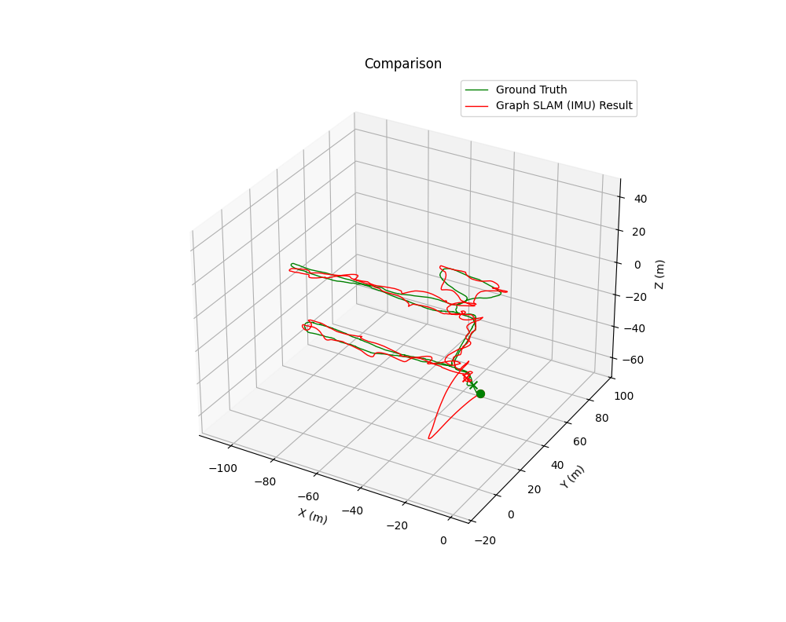
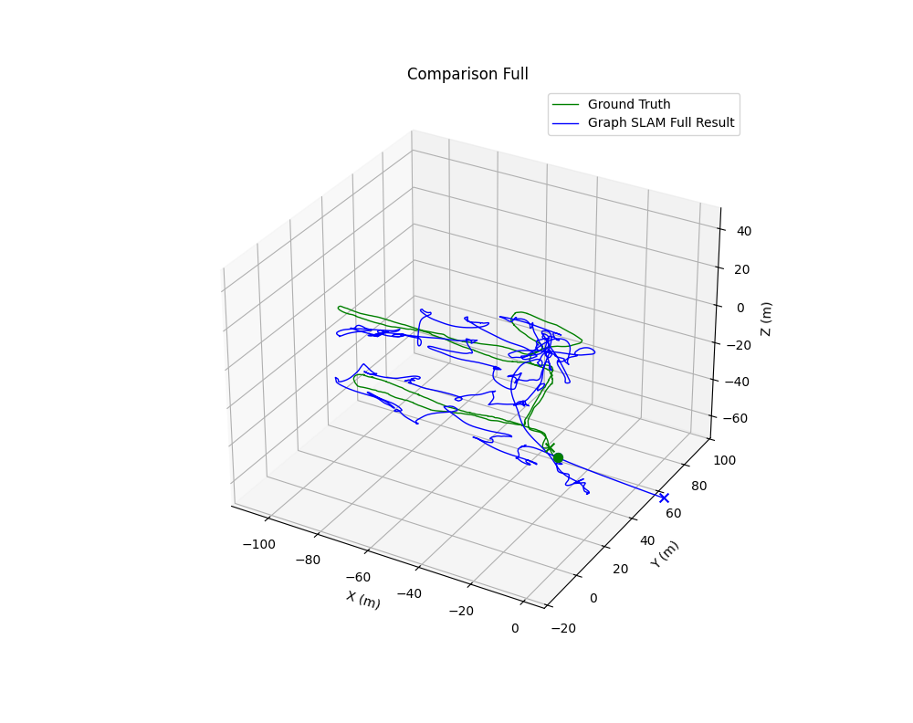

# AUV Graph SLAM

This repository implements a Graph-based SLAM system for an Autonomous Underwater Vehicle (AUV) using the GTSAM library.

The system fuses data from multiple sensors; IMU, DVL, and a Depth Sensor to estimate the vehicle's 3D trajectory and sensor biases. It utilizes IMU Preintegration for efficient processing of high-frequency inertial data and corrects drift using velocity and depth updates.

## Features
- Combines IMU (Acceleration/Gyro), DVL (Body Velocity), and Depth (Pressure) measurements.
- Uses `gtsam.PreintegratedImuMeasurements` for robust inertial navigation.
- Implements custom GTSAM factors for DVL and Depth constraints.

## Prerequisites

You will need **Python 3.x** and the following dependencies:

```bash
pip install gtsam numpy pandas matplotlib scipy
```
Note: If you are running on Linux and encounter a Qt platform plugin error, you may need to install the `libxcb-cursor0` library via your package manager.

## Dataset
This project uses the Girona AUV Dataset (specifically the Caves dataset).

Source: [CIRS - University of Girona (Caves Dataset)](https://cirs.udg.edu/caves-dataset/)

## Code Overview
* `auv_graph_slam.py`: The core class. Defines the factor graph, adds PriorFactor, ImuFactor, and custom CustomFactor for DVL/Depth, and handles optimization.

* `data_loader.py`: Static helper class to parse CSV files into dictionaries.

* `test_auv_slam.py`: Main entry point. Loads data, applies smoothing, constructs the graph, and visualizes results.

* `utils.py`: Visualization tools for plotting 3D poses and trajectories.

## Usage
Configure Paths: Ensure your CSV files are in the `./full_dataset` folder (or modify the `DATA_DIR` variable in `test_auv_slam.py`).

Run the Main Script:
```bash
python test_auv_slam.py
```
### Expected Output

The script performs two experiments sequentially:

1. IMU-Only Graph: Runs SLAM using only IMU preintegration (Dead Reckoning) and plots the drift compared to ground truth.



2. Full Graph Fusion: Runs SLAM fusing IMU, DVL, and Depth data.



